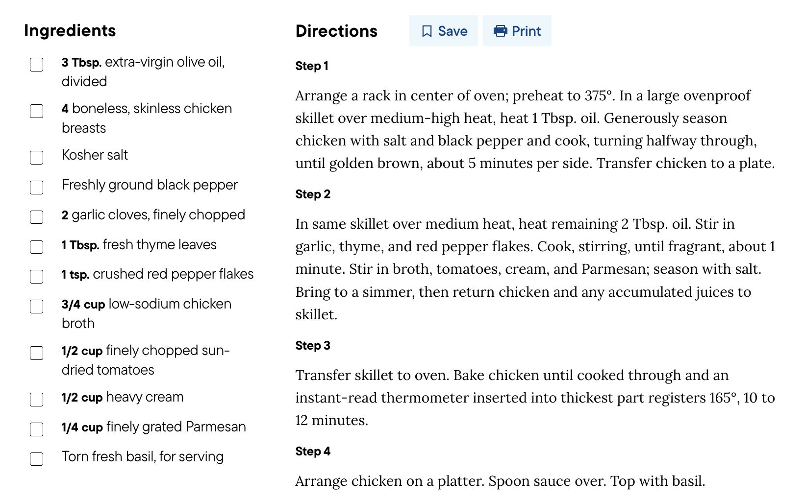
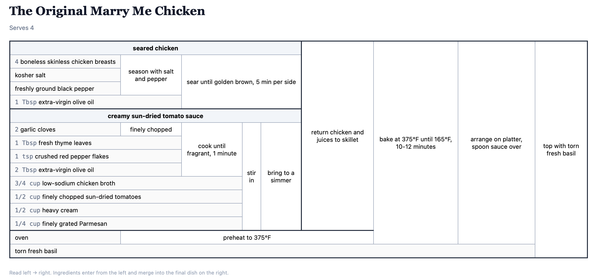

# brents-ai-stuff

A collection of skills for [Claude Code](https://claude.ai/code) - Anthropic's AI coding assistant you run in your terminal.

## What's in here

| Skill | What it does |
|-------|-------------|
| `recipe-engineer` | Converts any recipe into a [Cooking for Engineers](https://www.cookingforengineers.com)-style grid showing ingredient flow, parallel steps, and merges |

---

## Example Recipe Conversion

**Before**

Maybe it's just me, but when I see blob-of-text recipes like this, it hurts my brain, and I find myself re-reading it 16 times as I'm cooking



Image source: https://www.delish.com/cooking/recipe-ideas/a46330/skillet-sicilian-chicken-recipe/

**After**



## Prerequisites

### 1. Install Claude Code

Claude Code is a CLI tool that runs in your terminal.

```bash
npm install -g @anthropic-ai/claude-code
```

You'll need a Claude account at [claude.ai](https://claude.ai) and an API key from [console.anthropic.com](https://console.anthropic.com).

### 2. Install `uv` (Python package manager)

This project uses `uv` to manage Python dependencies.

```bash
curl -LsSf https://astral.sh/uv/install.sh | sh
```

---

## Setup

### 1. Clone this repo

```bash
git clone https://github.com/bbrewington/brents-ai-stuff
cd brents-ai-stuff
```

### 2. Install Python dependencies

```bash
uv sync
```

This installs `recipe_grid`, the library that powers the recipe-engineer skill.

### 3. Install the skill

```bash
mkdir -p .claude/skills
cp -r skills/recipe-engineer .claude/skills/recipe-engineer
```

---

## Using the recipe-engineer skill

### Start Claude Code in this directory

```bash
claude
```

Claude Code will automatically detect the skills in `.claude/skills/` when you open this folder.

### Convert a recipe

Just paste or describe a recipe and ask Claude to engineer it:

> "Convert this recipe into a TRN grid"

> "Engineer this recipe for me" *(then paste the recipe)*

> "Here's a URL to a recipe - can you make a Cooking for Engineers table from it?"

Claude will:
1. Parse the recipe and translate it into the `recipe_grid` DSL
2. Run the Python pipeline to compute the grid layout
3. Produce an **interactive React artifact** - the TRN matrix showing ingredient flow
4. Produce a **recipe widget** with timers and serving adjustments

### What is a TRN grid?

Tabular Recipe Notation (inspired by [Cooking for Engineers](http://www.cookingforengineers.com/)) is a matrix that shows:
- Each ingredient as a row
- Each preparation step as a cell
- How ingredients merge into combined components
- Which steps can happen **in parallel**

---

## Project structure

```
.claude/
  skills/
    recipe-engineer/
      SKILL.md                  # Skill instructions Claude reads automatically
      references/
        react-template.md       # React component template for the TRN grid
      scripts/
        recipe_to_json.py       # Python pipeline: DSL → JSON

skills/                         # Source copy of skills (same content as .claude/skills/)
pyproject.toml                  # Python project config (uv)
```

---

## Troubleshooting

**`uv: command not found`** - Re-run the `uv` install command above and restart your terminal.

**`recipe_grid` import errors** - Make sure you ran `uv sync` from the repo root.

**Claude doesn't seem to know about the skill** - Make sure you launched `claude` from inside the `brents-ai-stuff` directory. Skills are loaded from `.claude/skills/` relative to where you start Claude Code.
